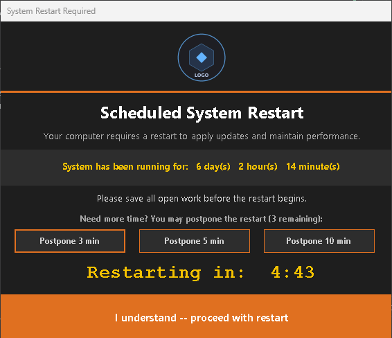

# Windows Reboot Script

A PowerShell script that monitors system uptime and prompts users with a branded WinForms dialog to restart their computer when the uptime threshold is exceeded.

## Dialog Preview



## Features

- Runs silently in the background (hidden console window)
- Displays a branded dark-theme WinForms dialog when a restart is required
- Shows current uptime, a live countdown timer, and postpone options
- Supports an optional organization logo
- Limits postponements to prevent indefinite deferral
- Logs all events (uptime checks, postponements, restarts) to a configurable log file

## Configuration

Open `reboot_script.ps1` and adjust the variables at the top of the file:

| Variable | Default | Description |
|---|---|---|
| `$LogFile` | `C:\Scripts\reboot_script.log` | Path where log entries are written |
| `$ThresholdDays` | `5` | Days of uptime before the restart dialog appears |
| `$MaxPostpones` | `3` | How many times a user can postpone the restart |
| `$CountdownSeconds` | `300` | Seconds on the countdown timer before auto-restart |
| `$LogoPath` | `C:\Scripts\logo.png` | Path to your organization logo (PNG). Set to `$null` to hide. |

To use hours or minutes as your threshold instead of days, replace `$ThresholdDays` with `$ThresholdHours` or `$ThresholdMinutes` and update the comparison:
```powershell
if ($Uptime.TotalHours -gt $ThresholdHours) { ... }
```

## Logo / Branding

Place a PNG logo at the path defined by `$LogoPath`. The dialog scales it to 80px tall while preserving the aspect ratio, then centers it at the top of the window. For best quality, use a source image that is at least 160px tall in a landscape/horizontal orientation. If the file does not exist, no logo is shown and the dialog still works normally.

Brand colors (accent, panel, text) are defined as named variables near the top of the dialog block and can be adjusted to match your organization's palette.

## Deployment via Group Policy

1. Copy `reboot_script.ps1` to a network share or deploy it to a local path on each machine (e.g. `C:\Scripts\reboot_script.ps1`).
2. Create a GPO with a **Scheduled Task** that runs the script on a recurring schedule (e.g. daily at logon or every 4 hours).
3. Ensure the scheduled task runs under an account with local administrator rights (required for the `shutdown` command).
4. Optionally deploy the logo file to the path specified by `$LogoPath` via GPO file copy or startup script.

## Log File

Each run appends a timestamped entry to `$LogFile`:

```
05/16/2026 08:00:00 = Current Uptime: 6 days, 2 hours, 14 minutes
05/16/2026 08:00:00 = User postponed restart for 10 minutes (postpone 1 of 3)
05/16/2026 08:10:00 = User acknowledged restart warning
05/16/2026 08:10:05 = System has been Rebooted
```

## Requirements

- Windows 10 / 11
- PowerShell 5.1 or later
- Administrator privileges (required to execute `shutdown /r`)
- .NET Framework (included with Windows — provides `System.Windows.Forms`)
